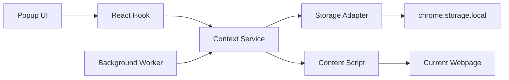

# Architecture

AI Context Collector is a Manifest V3 Chrome Extension built with React, TypeScript, and Vite. The extension has no backend and stores all data locally in `chrome.storage.local`.

## Popup

The popup is the only user interface. It renders collected context items, supports adding the active page, deleting one item, clearing all items, and copying generated Markdown.

Responsibilities:

- Render the user interface.
- Call hooks and services in response to user actions.
- Show success and error toasts.
- Avoid direct `chrome.storage.local` access.

## Background

The background service worker owns Chrome extension event wiring.

Responsibilities:

- Create the right-click context menu.
- Route context-menu clicks to the content script.
- Persist collected page context through services.
- Keep business rules out of event handlers.

The background layer should remain thin. It coordinates extension events but does not format Markdown or know storage internals.

## Content

The content script collects information from the current webpage.

Responsibilities:

- Read `document.title`.
- Read `location.href`.
- Read the current text selection.
- Respond to collection messages from the popup or background service worker.

The content script does not store data and does not generate Markdown.

## Storage

The storage layer is the only place that talks directly to `chrome.storage.local`.

Responsibilities:

- Read context items.
- Save context items.
- Add, delete, and clear items.
- Convert Chrome callback APIs into typed Promises.

## Services

Services contain business logic shared by the popup and background worker.

Responsibilities:

- Create complete `ContextItem` records.
- Export context items as Markdown.
- Coordinate content-script collection and storage writes.

## Relationship

This structure keeps extension APIs near the boundaries and leaves reusable behavior in small service and utility functions.
